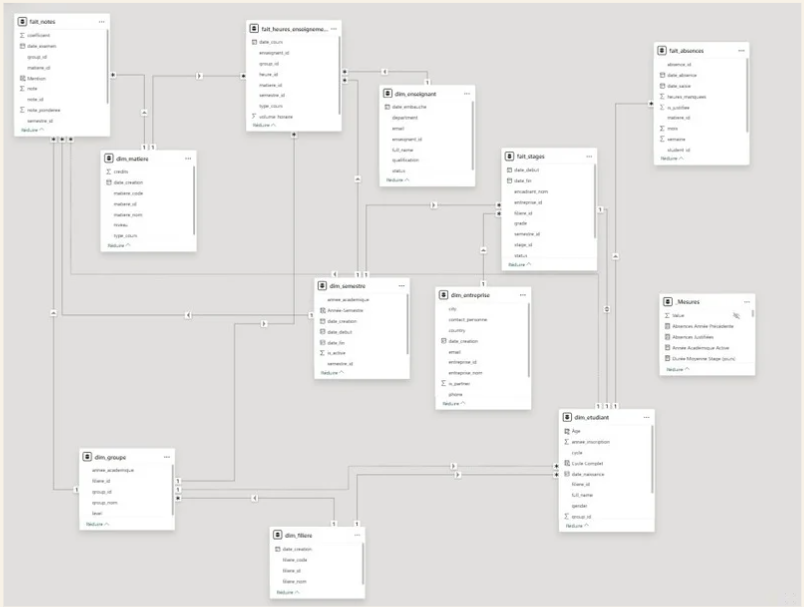

# Tableaux de Bord Power BI — Gestion d’une École d’Ingénieurs

### *Projet BI : Modélisation • ETL • KPI • Power BI*

---

## 📘 **1. Présentation du projet**

Ce projet consiste à concevoir un **système complet de Business Intelligence (BI)** pour une école d’ingénieurs, permettant d’améliorer le suivi :

* des **étudiants**,
* des **enseignants**,
* des **absences**,
* des **notes**,
* des **stages**,
* et du **volume horaire**.

L’objectif était de mettre en place une solution **professionnelle, scalable et documentée**, incluant :

* un pipeline **ETL** structuré (Bronze → Silver → Gold),
* une **modélisation en étoile**,
* des **mesures DAX** organisées en dossiers,
* des **dashboards Power BI** visuels et dynamiques,
* un dépôt GitHub propre et organisé,
* une **planification complète sur Notion**.

---

## 📁 **2. Structure du dépôt**

```plaintext
data-etl-power-bi/
│
├── 01_donnees/           # Jeux de données brutes (CSV)
├── 02_scripts/           # Scripts de traitement & ETL
│     ├── 01_nettoyages_csv.py
│     ├── 02_validation_donnees.py
│     └── requirements.txt
│
├── 03_documentation/     # Documents techniques, schémas, PDF
│
├── ecole_ingenieur_ensat.pbix   # Tableau de bord Power BI final
├── template.png                   # Template visuel utilisé
└── README.md                      # Ce fichier
```

---

## **3. Architecture ETL (Bronze / Silver / Gold)**

Nous avons adopté une approche professionnelle inspirée des architectures modernes :

### **🔹 Bronze — Données brutes**

Collecte des fichiers CSV tels que fournis par l’école.
→ *Pas de transformation, seulement un dépôt contrôlé.*

### **🔹 Silver — Données nettoyées & standardisées**

Traitements appliqués :

* Typage des colonnes
* Nettoyage des valeurs manquantes
* Harmonisation des noms
* Normalisations (dates, codes, filières)

### **🔹 Gold — Couches analytiques**

Tables prêtes pour Power BI :

* **Faits** : Absences, Notes, Stages, Volume Horaire
* **Dimensions** : Étudiants, Enseignants, Filières, Matières, Entreprises

📌 *Les scripts sont disponibles dans `/02_scripts`.*

---

## 🧩 **4. Modélisation — Schéma en étoile**

Nous avons construit un modèle orienté performance avec une séparation claire Fait / Dimensions.

👉 **Capture du modèle Power BI** (à ajouter ici)




---

## **5. Mesures DAX & Organisation dans Power BI**

Pour garantir la maintenabilité et la clarté, nous avons :

* créé un **grand nombre de mesures DAX**,
* **structuré ces mesures en dossiers** correspondant aux domaines :

📁 *Exemples de dossiers :*

* `Absences_Measures`
* `Notes_Measures`
* `Stages_Measures`
* `Enseignants_Measures`
* `Global_KPI`


---

## **6. Dashboards Power BI**

Les dashboards suivants ont été développés :

---

### ⭐ **Dashboard – Accueil**

KPIs principaux :

* Nombre d’étudiants
* Nombre d’enseignants
* Taux d’absence
* Moyenne générale
* Stages réalisés
* Total volume horaire

---

### 📉 **Dashboard – Absences**

KPI & analyses :

* Taux global d’absence
* Absences justifiées / injustifiées
* Top 15 des étudiants avec le plus d’absences

---

### 📚 **Dashboard – Notes**

KPIs :

* Moyenne générale
* Taux de réussite
* Distribution des notes
* Top / Bottom étudiants

---

### 🏢 **Dashboard – Stages & Enseignants**

Analyses :

* Répartition des stages par entreprise
* Durée moyenne des stages
* Volume horaire enseignant
* Statut (permanent/vacataire)

---

## 🔗 **7. Liens utiles**

### 📘 **Notion — Planification complète du projet**

[https://www.notion.so/Tableaux-de-Bord-Power-BI-pour-cole-d-Ing-nieurs-2b31bbeb073e80748613f8382e6fd84a](https://www.notion.so/Tableaux-de-Bord-Power-BI-pour-cole-d-Ing-nieurs-2b31bbeb073e80748613f8382e6fd84a)

### 🧑‍💻 **GitHub — Code & Documentation**

[https://github.com/8sylla/data-etl-power-bi.git](https://github.com/8sylla/data-etl-power-bi.git)

---

## 🏁 **8. Conclusion**

Ce projet illustre la mise en place d’une véritable **solution de Business Intelligence académique**, couvrant l’ensemble de la chaîne :

* collecte des données
* nettoyage et transformation (ETL)
* modélisation analytique
* création de KPIs
* développement de dashboards interactifs
* documentation & organisation professionnelle

Il constitue une base solide pour l’évolution du SI décisionnel d’une école d’ingénieurs.

---

## 📎 **9. Auteurs**

* **Sylla N’faly**
* **El Adnani El Mehdi**
* **Chaiberras Souhail**
